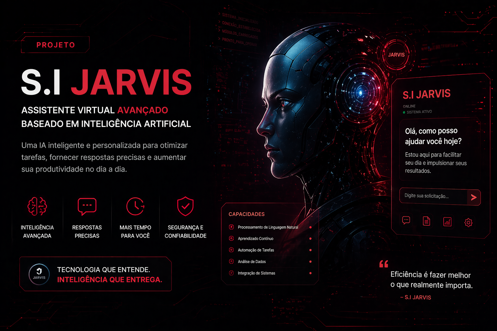

<div align="center">
  
</div>
# 🎙️ S.I. JARVIS - Mark 85


Este projeto é um assistente virtual avançado inspirado no Jarvis (Homem de Ferro). Ele utiliza a API do **Groq (Llama 3.3)** para processar inteligência artificial com velocidade extrema e o **Edge-TTS** para fornecer uma voz neural humana e realista.

---

## 🛠️ Tecnologias Utilizadas

* **Python:** Linguagem base do projeto.
* **Groq Cloud API:** Cérebro do assistente (Modelo Llama 3.3-70b).
* **Edge-TTS:** Síntese de voz de alta fidelidade (Microsoft).
* **Speech Recognition:** Reconhecimento de fala via Google.
* **SoundDevice / SciPy:** Captura e gravação de áudio do microfone.

---

## 🔑 Como Conseguir sua Chave de API (Passo a Passo)

Para que o Jarvis funcione, você precisa de uma chave gratuita da Groq Cloud. Siga estes passos:

1. Acesse o site oficial: [Groq Cloud Console](https://console.groq.com/keys).
2. Faça login com sua conta do Google ou GitHub.
3. No menu lateral esquerdo, clique em **"API Keys"**.
4. Clique no botão azul **"Create API Key"**.
5. Dê um nome para a chave (ex: "Jarvis_Mark85").
6. **Copie a chave gerada imediatamente** (ela começa com `gsk_...`).
7. No arquivo `main.py` do projeto, localize a linha `CHAVE_GROQ = "COLOQUE_SUA_CHAVE_AQUI"` e cole sua chave entre as aspas.

---

## 🚀 Como Instalar e Rodar

### 1. Requisitos
Você precisará do Python instalado e do **Windows Media Player** (nativo do Windows) habilitado para os efeitos sonoros de inicialização.

### 2. Instalação das Dependências
Abra o terminal na pasta do projeto e execute:
```bash
pip install -r requirements.txt

Com certeza! Vou unir as instruções do projeto com o guia passo a passo de como conseguir a chave da API em um único README.md completo e profissional.

Copie o conteúdo abaixo e salve como README.md:

Markdown
# 🎙️ S.I. JARVIS - Mark 85


Este projeto é um assistente virtual avançado inspirado no Jarvis (Homem de Ferro). Ele utiliza a API do **Groq (Llama 3.3)** para processar inteligência artificial com velocidade extrema e o **Edge-TTS** para fornecer uma voz neural humana e realista.

---

## 🛠️ Tecnologias Utilizadas

* **Python:** Linguagem base do projeto.
* **Groq Cloud API:** Cérebro do assistente (Modelo Llama 3.3-70b).
* **Edge-TTS:** Síntese de voz de alta fidelidade (Microsoft).
* **Speech Recognition:** Reconhecimento de fala via Google.
* **SoundDevice / SciPy:** Captura e gravação de áudio do microfone.

---

## 🔑 Como Conseguir sua Chave de API (Passo a Passo)

Para que o Jarvis funcione, você precisa de uma chave gratuita da Groq Cloud. Siga estes passos:

1. Acesse o site oficial: [Groq Cloud Console](https://console.groq.com/keys).
2. Faça login com sua conta do Google ou GitHub.
3. No menu lateral esquerdo, clique em **"API Keys"**.
4. Clique no botão azul **"Create API Key"**.
5. Dê um nome para a chave (ex: "Jarvis_Mark85").
6. **Copie a chave gerada imediatamente** (ela começa com `gsk_...`).
7. No arquivo `main.py` do projeto, localize a linha `CHAVE_GROQ = "COLOQUE_SUA_CHAVE_AQUI"` e cole sua chave entre as aspas.

---

## 🚀 Como Instalar e Rodar

### 1. Requisitos
Você precisará do Python instalado e do **Windows Media Player** (nativo do Windows) habilitado para os efeitos sonoros de inicialização.

### 2. Instalação das Dependências
Abra o terminal na pasta do projeto e execute:
```bash
pip install -r requirements.txt
3. Execução
Com a sua chave de API já inserida no código, execute:
python main.py
Com certeza! Vou unir as instruções do projeto com o guia passo a passo de como conseguir a chave da API em um único README.md completo e profissional.

Copie o conteúdo abaixo e salve como README.md:

Markdown
# 🎙️ S.I. JARVIS - Mark 85


Este projeto é um assistente virtual avançado inspirado no Jarvis (Homem de Ferro). Ele utiliza a API do **Groq (Llama 3.3)** para processar inteligência artificial com velocidade extrema e o **Edge-TTS** para fornecer uma voz neural humana e realista.

---

## 🛠️ Tecnologias Utilizadas

* **Python:** Linguagem base do projeto.
* **Groq Cloud API:** Cérebro do assistente (Modelo Llama 3.3-70b).
* **Edge-TTS:** Síntese de voz de alta fidelidade (Microsoft).
* **Speech Recognition:** Reconhecimento de fala via Google.
* **SoundDevice / SciPy:** Captura e gravação de áudio do microfone.

---

## 🔑 Como Conseguir sua Chave de API (Passo a Passo)

Para que o Jarvis funcione, você precisa de uma chave gratuita da Groq Cloud. Siga estes passos:

1. Acesse o site oficial: [Groq Cloud Console](https://console.groq.com/keys).
2. Faça login com sua conta do Google ou GitHub.
3. No menu lateral esquerdo, clique em **"API Keys"**.
4. Clique no botão azul **"Create API Key"**.
5. Dê um nome para a chave (ex: "Jarvis_Mark85").
6. **Copie a chave gerada imediatamente** (ela começa com `gsk_...`).
7. No arquivo `main.py` do projeto, localize a linha `CHAVE_GROQ = "COLOQUE_SUA_CHAVE_AQUI"` e cole sua chave entre as aspas.

---

## 🚀 Como Instalar e Rodar

### 1. Requisitos
Você precisará do Python instalado e do **Windows Media Player** (nativo do Windows) habilitado para os efeitos sonoros de inicialização.

### 2. Instalação das Dependências
Abra o terminal na pasta do projeto e execute:
```bash
pip install -r requirements.txt
3. Execução
Com a sua chave de API já inserida no código, execute:

Bash
python main.py
🎙️ Protocolos de Voz (Como Interagir)
O Jarvis opera através de comandos de voz específicos:

Ativação do Sistema: Diga "Acordem crianças" para iniciar a sequência de boot e carregar os protocolos.

Interação com a IA: Qualquer frase deve começar com o nome dele (ex: "Jarvis, qual a distância da Terra até a Lua?").

Hibernação: Diga "Dormir" ou "Descansar" para desligar o assistente.
Com certeza! Vou unir as instruções do projeto com o guia passo a passo de como conseguir a chave da API em um único README.md completo e profissional.

Copie o conteúdo abaixo e salve como README.md:

Markdown
# 🎙️ S.I. JARVIS - Mark 85


Este projeto é um assistente virtual avançado inspirado no Jarvis (Homem de Ferro). Ele utiliza a API do **Groq (Llama 3.3)** para processar inteligência artificial com velocidade extrema e o **Edge-TTS** para fornecer uma voz neural humana e realista.

---

## 🛠️ Tecnologias Utilizadas

* **Python:** Linguagem base do projeto.
* **Groq Cloud API:** Cérebro do assistente (Modelo Llama 3.3-70b).
* **Edge-TTS:** Síntese de voz de alta fidelidade (Microsoft).
* **Speech Recognition:** Reconhecimento de fala via Google.
* **SoundDevice / SciPy:** Captura e gravação de áudio do microfone.

---

## 🔑 Como Conseguir sua Chave de API (Passo a Passo)

Para que o Jarvis funcione, você precisa de uma chave gratuita da Groq Cloud. Siga estes passos:

1. Acesse o site oficial: [Groq Cloud Console](https://console.groq.com/keys).
2. Faça login com sua conta do Google ou GitHub.
3. No menu lateral esquerdo, clique em **"API Keys"**.
4. Clique no botão azul **"Create API Key"**.
5. Dê um nome para a chave (ex: "Jarvis_Mark85").
6. **Copie a chave gerada imediatamente** (ela começa com `gsk_...`).
7. No arquivo `main.py` do projeto, localize a linha `CHAVE_GROQ = "COLOQUE_SUA_CHAVE_AQUI"` e cole sua chave entre as aspas.

---

## 🚀 Como Instalar e Rodar

### 1. Requisitos
Você precisará do Python instalado e do **Windows Media Player** (nativo do Windows) habilitado para os efeitos sonoros de inicialização.

### 2. Instalação das Dependências
Abra o terminal na pasta do projeto e execute:
```bash
pip install -r requirements.txt
3. Execução
Com a sua chave de API já inserida no código, execute:

Bash
python main.py
🎙️ Protocolos de Voz (Como Interagir)
O Jarvis opera através de comandos de voz específicos:

Ativação do Sistema: Diga "Acordem crianças" para iniciar a sequência de boot e carregar os protocolos.

Interação com a IA: Qualquer frase deve começar com o nome dele (ex: "Jarvis, qual a distância da Terra até a Lua?").

Hibernação: Diga "Dormir" ou "Descansar" para desligar o assistente.

👨‍💻 Desenvolvedor
Projeto desenvolvido por Matheus para fins de portfólio em Inteligência Artificial e Automação Python.
Com certeza! Vou unir as instruções do projeto com o guia passo a passo de como conseguir a chave da API em um único README.md completo e profissional.

Copie o conteúdo abaixo e salve como README.md:

Markdown
# 🎙️ S.I. JARVIS - Mark 85


Este projeto é um assistente virtual avançado inspirado no Jarvis (Homem de Ferro). Ele utiliza a API do **Groq (Llama 3.3)** para processar inteligência artificial com velocidade extrema e o **Edge-TTS** para fornecer uma voz neural humana e realista.

---

## 🛠️ Tecnologias Utilizadas

* **Python:** Linguagem base do projeto.
* **Groq Cloud API:** Cérebro do assistente (Modelo Llama 3.3-70b).
* **Edge-TTS:** Síntese de voz de alta fidelidade (Microsoft).
* **Speech Recognition:** Reconhecimento de fala via Google.
* **SoundDevice / SciPy:** Captura e gravação de áudio do microfone.

---

## 🔑 Como Conseguir sua Chave de API (Passo a Passo)

Para que o Jarvis funcione, você precisa de uma chave gratuita da Groq Cloud. Siga estes passos:

1. Acesse o site oficial: [Groq Cloud Console](https://console.groq.com/keys).
2. Faça login com sua conta do Google ou GitHub.
3. No menu lateral esquerdo, clique em **"API Keys"**.
4. Clique no botão azul **"Create API Key"**.
5. Dê um nome para a chave (ex: "Jarvis_Mark85").
6. **Copie a chave gerada imediatamente** (ela começa com `gsk_...`).
7. No arquivo `main.py` do projeto, localize a linha `CHAVE_GROQ = "COLOQUE_SUA_CHAVE_AQUI"` e cole sua chave entre as aspas.

---

## 🚀 Como Instalar e Rodar

### 1. Requisitos
Você precisará do Python instalado e do **Windows Media Player** (nativo do Windows) habilitado para os efeitos sonoros de inicialização.

### 2. Instalação das Dependências
Abra o terminal na pasta do projeto e execute:
```bash
pip install -r requirements.txt
3. Execução
Com a sua chave de API já inserida no código, execute:

Bash
python main.py
🎙️ Protocolos de Voz (Como Interagir)
O Jarvis opera através de comandos de voz específicos:

Ativação do Sistema: Diga "Acordem crianças" para iniciar a sequência de boot e carregar os protocolos.

Interação com a IA: Qualquer frase deve começar com o nome dele (ex: "Jarvis, qual a distância da Terra até a Lua?").

Hibernação: Diga "Dormir" ou "Descansar" para desligar o assistente.

👨‍💻 Desenvolvedor
Projeto desenvolvido por Matheus para fins de portfólio em Inteligência Artificial e Automação Python.

Nota: Este projeto é destinado a fins educacionais e de demonstração tecnológica.
### 💡 Dicas Finais para o seu GitHub:
1.  **Crie o arquivo:** No seu computador, clique com o botão direito > Novo Documento de Texto > Nomeie como `README.md` (remova o `.txt`).
2.  **Suba no GitHub:** Arraste esse arquivo junto com o `main.py`, `requirements.txt`, `iniciar.mp3` e as imagens.
3.  **Resultado:** O GitHub vai ler esse arquivo automaticamente e transformar seu repositório em uma página super profissional, exatamente como você planejou!

Tudo pronto para o upload? Se precisar de ajuda com os próximos projetos do seu portfólio, é só chamar! 🚀
